==========================
How Does Jungle Disk Work?
==========================

.. RENAME setting up UI or setting up JD, rename the 5 section to setting up acct

make this actually about data de-dup and incremental backup and place below the network drive or put that into in 011howdoesbackupprocesswork

The *Jungle Disk client is a two part program.
It contains the *Jungle Disk agent, which is the service that gets installed and allows processes to run in the background. This agent communicates with your storage location (Rackspace Cloud File or Amazon) and is responsible for uploading and retrieving files when needed.
The Jungle Disk client also contains the *Jungle Disk monitor which is the User Interface component. It allows you to manage your settings. The only exception to this would be USB versions of Jungle Disk, which does not use a service, rather containing everything, including the UI, business logic (backups, de-dup), and communication to the storage location(s).

Jungle Disk Agent
=================
The Jungle Disk service can be accessed in the following locations:
Windows: [ Windows Key + r] > services.msc
Mac: Help (software menu option) > Manage Background Programs > enter system credentials
Linux: /usr/local/bin/

Resetting the Agent
-------------------
This is only necessary if your backups are not running and your network drives are not showing.
Backups not running and network drives not showing generally indicates an issue with the service either no longer communicating with our servers, or being stopped. Restarting the service will reset the connection and restart the service. This may fix the problem. To do this, follow the instructions below.

Windows
^^^^^^^^^^^

1. Press [ Windows Key + r ] and type services.msc

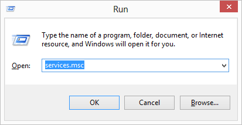

2. Right-click the JungleDiskWorkgroupService service and select Restart (or Start if it's not currently running).

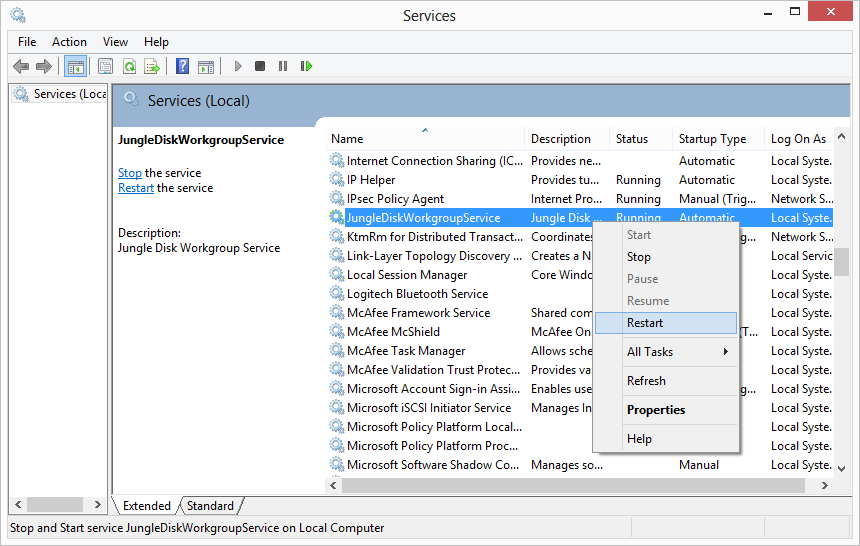

3. You can set the service to automatically restart upon failure by right-clicking the service, clicking Properties, clicking the Recovery tab, and setting all three "failure instances" to Restart the Service.

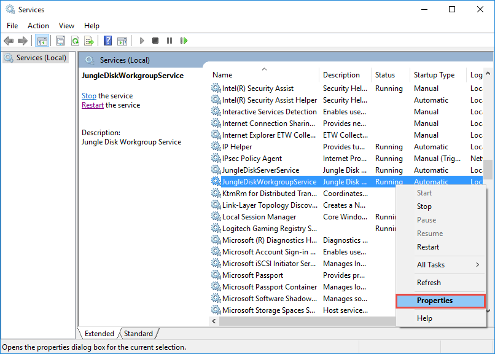

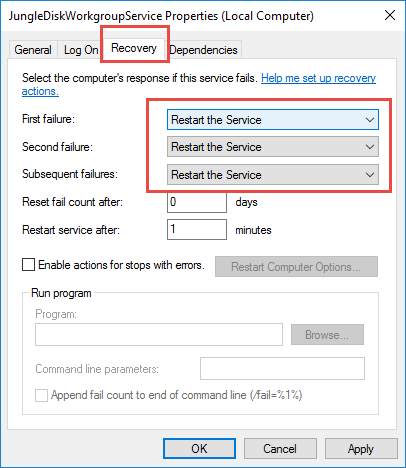

Mac
^^^^^^^

1. Access the service through the Activity Monitor by selecting Help > Manage Background Programs.

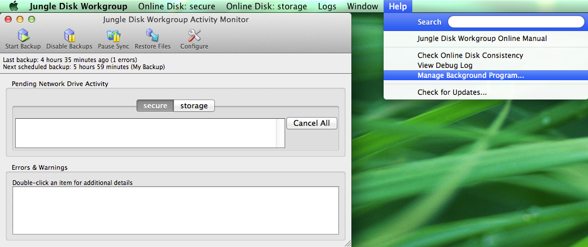

2. Enter your system username and password (Not your Jungle Disk username and password).

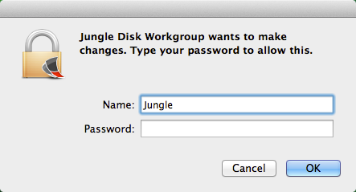

3. Select Stop, wait 1 minute, then select Start. (Select Start if the service is currently not running)

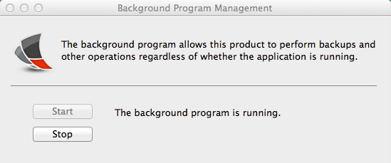

Linux
^^^^^^^^^

1. Run

::

  sudo service [JungleDiskWorkgroupService] restart

2. Or, run
::

  ps aux | grep jungle
Then
::

  sudo kill <PID>

Activity Monitor
================

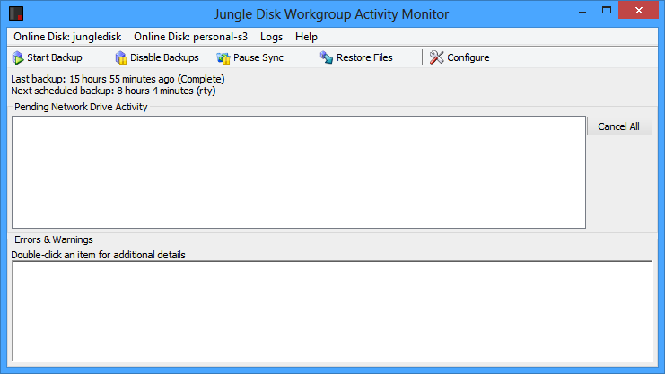
The Activity Monitor in Windows.

.. figure:: _static/004/o1.png
The Activity Monitor in Mac OS.

The Jungle Disk Activity Monitor allows users to control settings for:

* Backups
* Retention
* The network drive
* Caching
* Security
* Bandwidth limiting
* File sharing
* Network settings

and a few other options.

You can also manually alter the state for a few processes including:

* Starting a backup
* Pausing/resuming sync
* Run a consistency check
* Restore files
* Cleaning up a backup vault

The Errors & Warnings section in the bottom portion of the Activity Monitor will display any errors,  warnings, or results from running a consistency check.

The Configure option in the upper right is used to manage the settings within Jungle Disk. Any changes  made within this section are applied to the user’s local settings file. See THE SETTINGS FILE for more information.

Application Settings
====================
**Click "Configure", then "Application Settings".**

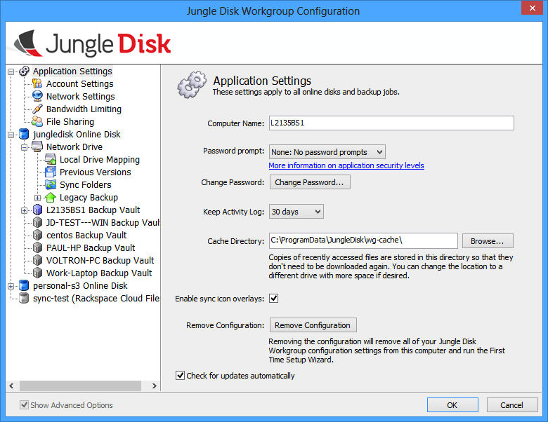
Windows.

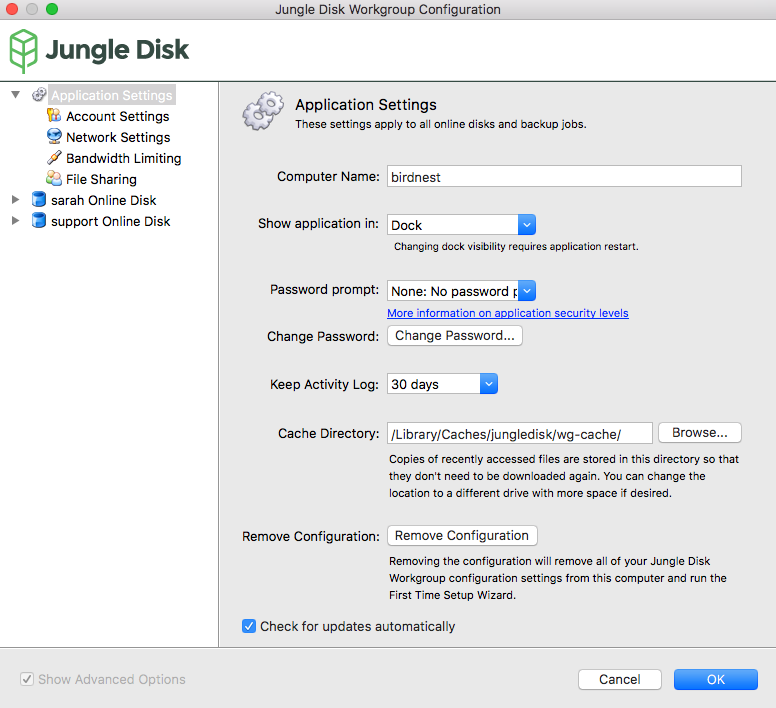
Mac.

**Computer Name:** This is the name of the computer the software is installed on. The computer name is pulled from the name listed within the operating system. This can be adjusted by entering a new name in  this field. The computer name will also be added to the backup vault name when it is created.  Example: The computer name in the Windows figure above is L2135BS1, so the backup vault is presented as L2135BS1 Backup Vault.

**Show application in:** (MAC ONLY) Show the Jungle Disk icon in your dock, status bar, or both.

**Password prompt:** Here, you can add an additional layer of security with a few different options.
The “Low” option adds a password prompt when any user clicks “Configure” from the main Activity Monitor screen.
The “Medium”  option prompts the user for their password each time the Activity Monitor is opened.
The “High” option  prompts the user for their password each time the service is started. This can occur when the computer  is initially booted or when the service is restarted.

**Change Password:** This allows the user to reset the password for their user account.

**Keep Activity Log:** This setting determines how long the Backup History Log (record of changes) and Network Drive Activity Log are kept before being purged. By default, this is set to 30 days.

**Cache Directory:** This is where the cache is stored on the user’s local machine. The cache holds:

* Temporary files used during backups
* Cached files stored when browsing the network drive
* Logs
* The backup database.

 If the location of the cache directory is changed, the service must be restarted in order for the new location to  be registered.

 **Enable sync icon overlays:** If enabled, this places a green checkmark over the file icon of a file that is  being synced via sync folders. If there is a problem syncing a file, a red “x” will be overlaid on the file’s icon.  If you can no longer see the icons, try disabling then re-enabling this option.

 **Remove Configuration:** This option logs you out of the current session and removes all information from within the configuration file, causing the first time setup wizard to start.

**Check for updates automatically:** If disabled, the user will need to check for updates manually.

Account Settings
================
**Click Configure, then Account Settings under Application Settings.**

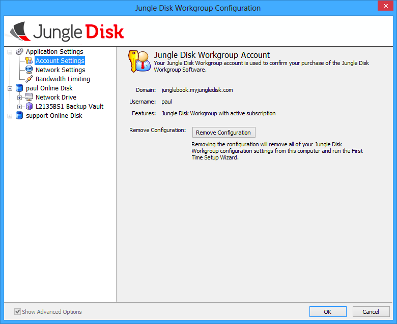
Windows.

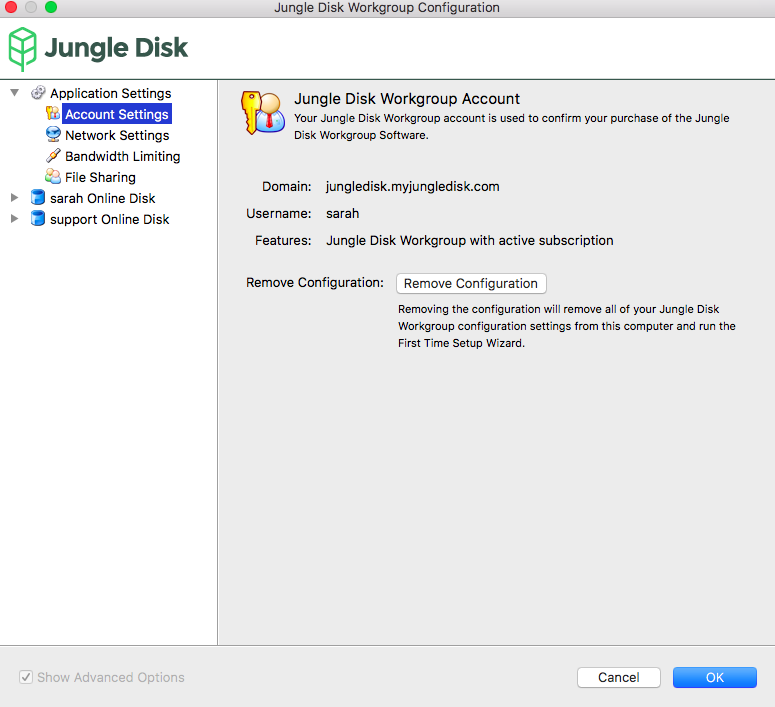
Mac.

**Account Settings:** This options shows your account details, including the domain and username you are currently logged in with. It also shows the type of Jungle Disk you are running and your subscription status.

**Remove Configuration:** Removes the current account settings and displays the  first time setup wizard.

Network Settings
================

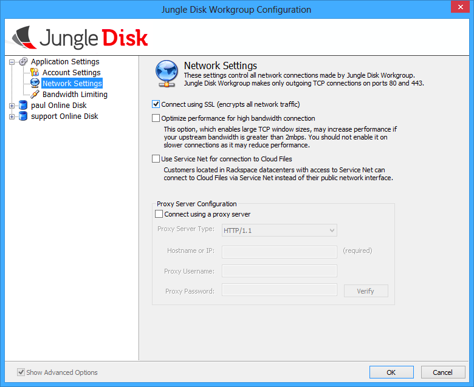
Windows.

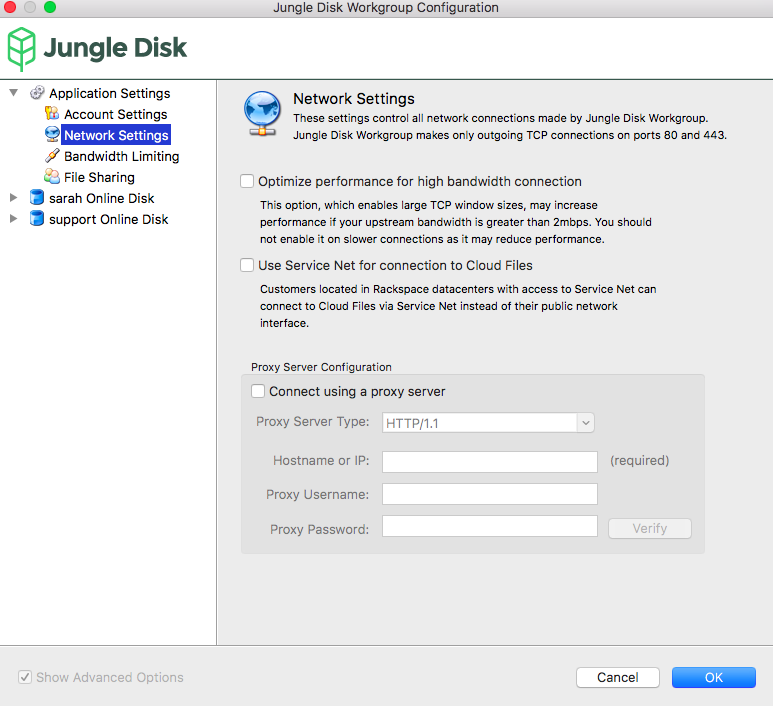
Mac.

**Connect using SSL (encrypts all network traffic):** (WINDOWS AND LINUX ONLY)
Enables SSL.

**Optimize performance...:** May increase performance if the user’s upstream bandwidth is greater than 2 Mbps.

**Use Service Net...:** This can be enabled if the user has a server in the same Rackspace data center that their storage location is held in.

 **Proxy Server Configuration:** Allows the user to configure a proxy.

 Bandwidth Settings
 ==================

 .. figure:: _static/004/bw.png
 Windows.

 .. figure:: _static/004/bw2.png
 Mac.

**Bandwidth Limiting:** When enabled, limits the upload and download bandwidth available.

**Enable upload resume for large files:** Allows file upload to be paused and resumed at a later time. Only upload changed portions of large files: This is another option that does exactly what it says.
