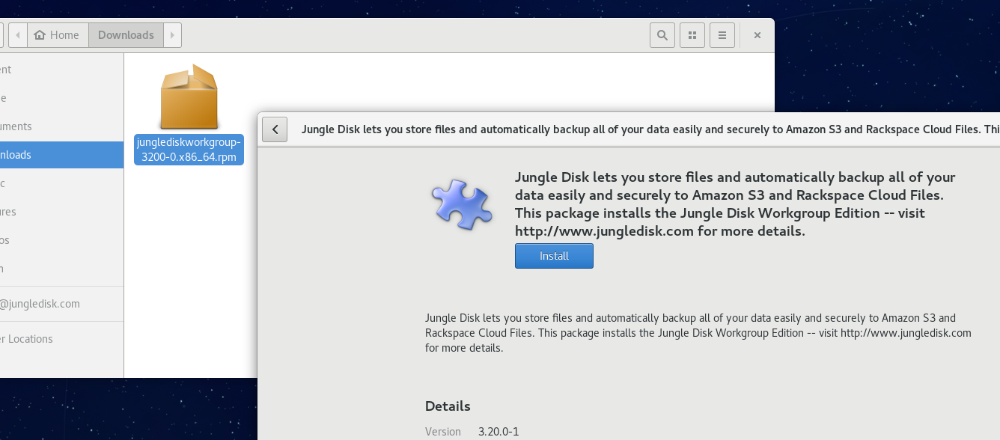
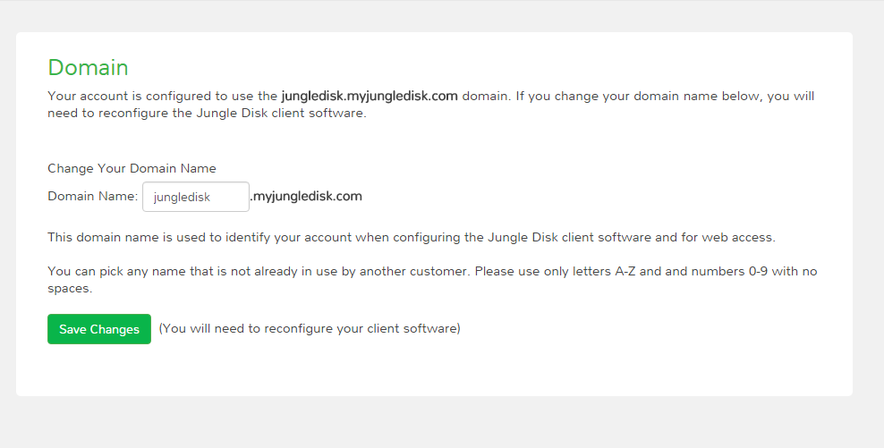
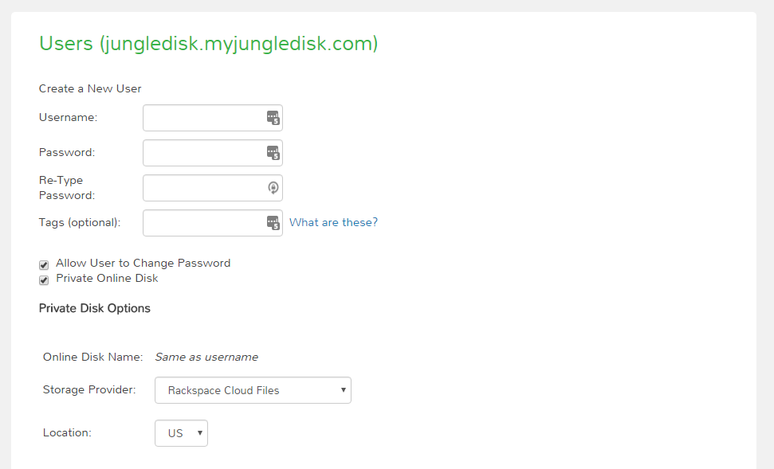
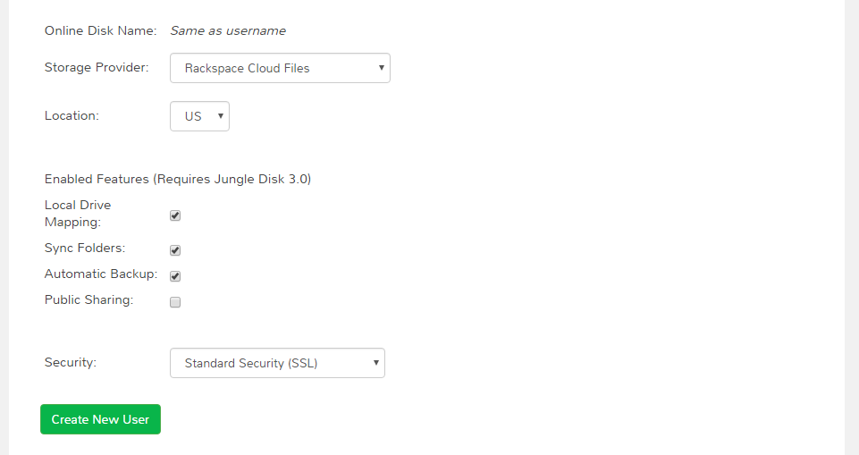
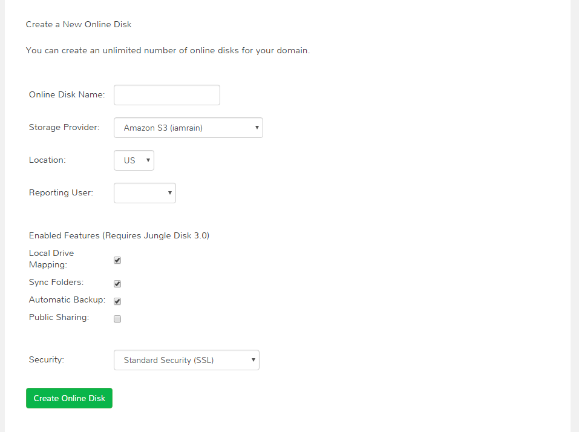
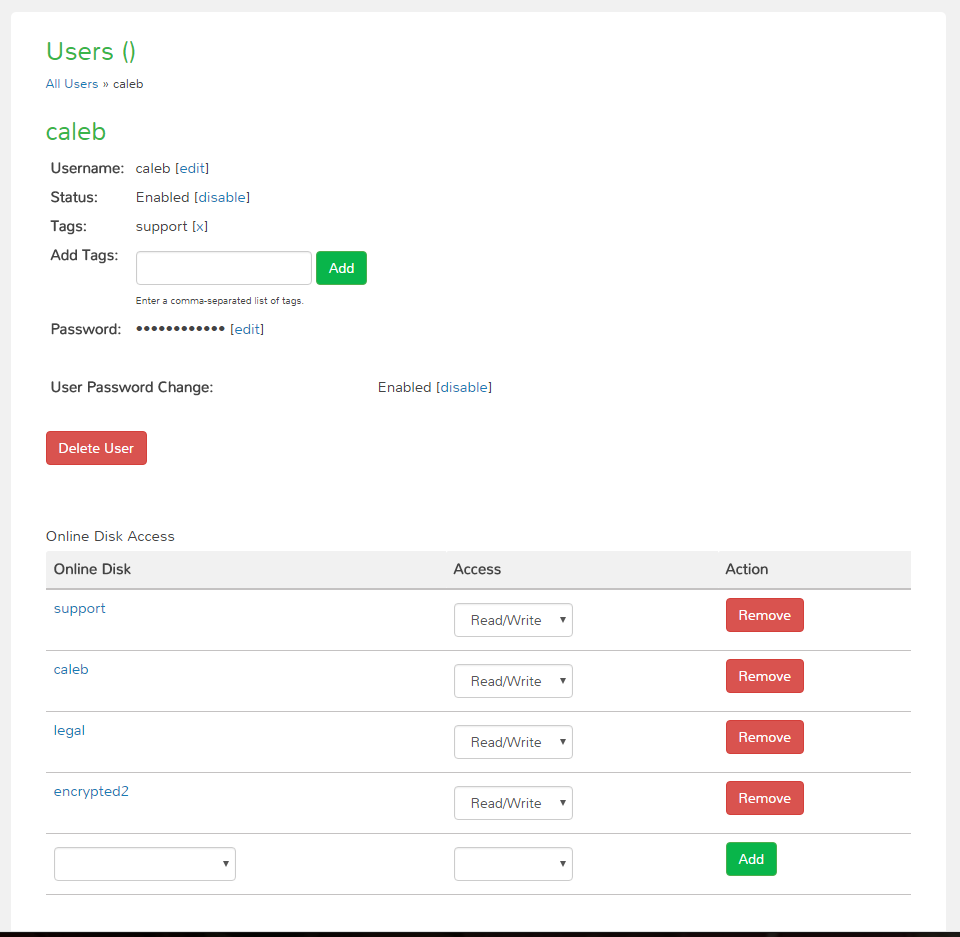

======================
Setting Up Jungle Disk
======================

This section contains important information for first time setup.

System Requirements
===================
Version 3.21

**Windows** | Windows 7 or newer. 64 bit only.

**Mac** | 10.9 (Mavericks) or newer.

**Linux** | Ubuntu (12.04, 14.04, 16.04), Fedora (23, 24, 25), CentOS (6, 7), RHEL (6, 7).
|br| x86, 64 bit system.
|br| Gnome, KDE, Cinnamon, or XFCE desktop. You may also need to install Fuse.
|br| While it is possible that other configurations may work, only those listed above are fully supported.

======================  ==================
Most Distributions      CentOS 6
======================  ==================
libfuse2 (>= 2.8.6)     fuse-libs >= 2.8.3
libacl1 (>= 2.2.51-1)   libacl >= 2.2.49
libc6 (>= 2.15)         glibc >= 2.12
libgcc1 (>= 1:4.6.3)    libgcc >= 4.4.7
libstdc++6 (>= 4.6.3)   libstdc++ >= 4.4.7
zlib1g (>= 1:1.2.0)     zlib >= 1.2.3
psmisc (>=22.15-1)      psmisc >= 22.6
libgtk2.0-0 (>=2.24.10  gtk2 >= 2.24.10
libnotify4 (>=0.7.5     libnotify >= 0.5.0
======================  ==================

.. See `this article <https://support.jungledisk.com/hc/en-us/articles/200812234-Linux-System-Requirements/>`_ for more information on Linux setup.

Installation
============

All versions are available for download on https://www.jungledisk.com/downloads/.

For Linux CentOS 6, please download the CentOS 6 version `here <https://secure.jungledisk.com/secure/account/downloads.aspx>`_ .

Windows
-------

#. Select the `Windows workgroup download <https://www.jungledisk.com/downloads/>`_.
#. Click "Save File" on the pop-up.
#. If the install package doesn't open on its own, check your browser's downloads area for the .msi file and open it.
#. A pop-up will appear. Click "Run".
#. The setup wizard will appear. Accept the End-User License Agreement, and select a drive to install the software on.
#. Once the software is installed, a prompt to restart will appear. You must restart to continue setting up the software.

Mac
---
.. youtube:: https://www.youtube.com/watch?v=AY_JpzEVPF0

#. Select the `macOS download <https://www.jungledisk.com/downloads/>`_.
#. Open the .dmg from the Downloads folder.
#. Drag the Jungle Disk icon into the Applications folder.
#. Open the Applications Folder, then Jungle Disk Workgroup. Your first set-up may take a few minutes.
#. If you are presented with a message that says the software will not open because it is from an unidentified developer, go to your Applications in finder, right-click the Jungle Disk app and select open.

.. Note:: If you have parental controls enabled on your Mac user account, you will need to add `https://s3.amazonaws.com` to the allowed sites list for your account or you may receive a "connection refused" error.

Linux
-----
`Select RPM, DEB, or TAR. <https://www.jungledisk.com/downloads/>`_
|br| For Linux CentOS 6, please download the CentOS 6 version `here <https://secure.jungledisk.com/secure/account/downloads.aspx>`_.

RPM-Based Systems
^^^^^^^^^^^^^^^^^
*The example RPM-based system used here is Fedora with the GNOME desktop environment.*

|br| **Via GUI**

1. Select the Linux RPM Workgroup download.

2. Once the package has downloaded, open and install it. Follow the prompts on screen.

|br|
**Via Terminal**

1. Use wget to download the installer package. Check our `downloads page <https://www.jungledisk.com/downloads/>`_ for the most recent version, and copy the link address of that version.
::

  wget https://downloads.jungledisk.com/jungledisk/junglediskworkgroup-3211-0.x86_64.rpm

2. Once downloaded, run the installation command. You can also use your desktop GUI to start the apps (this may require you to log-out and log-in.)
::

  dnf install junglediskworkgroup

3. Enter "Y" to approve the install.

4. Configure the settings file.

DEB-Based Systems
^^^^^^^^^^^^^^^^^

**If you have not installed Jungle Disk on an Ubuntu/Unity system before, there are a few additional steps that you will need to perform in order for Jungle Disk to function properly. These steps are necessary to utilize a "System Tray" that will appear in the top-right corner of your menu bar on your desktop.**

**12.04**

1. Open up Terminal and run the following command
::

  sudo apt-get install dconf-tools

2. Open dconf Editor (app installed by the previous command) and go to desktop > unity > panel.
3. Add ‘jungledisk’ (surrounded by single-quotes) within the systray-whitelist on the right.
4. You can now close terminal and continue either the GUI or terminal steps below.

**14.04 & 16.04**

1. Open up Terminal and run the following command to add a PPA (Personal Package Archives) to your apt repository list:
::

  sudo apt-add-repository ppa:fixnix/indicator-systemtray-unity

2. Next, run:
::

  sudo apt-get update

3. Now, run the following command to install the package:
::

  sudo apt-get install indicator-systemtray-unity

Install Jungle Disk, then log back out, and login again. The system tray will then show up.

**Via GUI**

1. Download DEB Linux Workgroup from our `downloads page. <https://www.jungledisk.com/downloads/>`_

2. Once the package has downloaded (likely to your downloads folder), open it up and you will be given the option to install. Click the install button and follow the prompts on screen.

.. Expand on Linux install directions https://support.jungledisk.com/hc/en-us/articles/115000012814-Updating-to-Jungle-Disk-3-20-for-Mac-and-Linux

**Via Terminal**

1. Use wget to download the installer package. Check our `downloads page <https://www.jungledisk.com/downloads/>`_ for the most recent version, and copy the link address of that version.
::

  wget https://downloads.jungledisk.com/jungledisk/junglediskworkgroup_321-1_amd64.deb

2. Once downloaded, run the installation command. You can also use your desktop GUI to start the apps (this may require you to log-out and log-in.)
::

  sudo dpkg -i junglediskworkgroup_321-1_amd64.deb

3. Configure the settings file.

TAR-Based Systems
^^^^^^^^^^^^^^^^^

1. Download TAR Linux Workgroup from our `downloads page <https://www.jungledisk.com/downloads/>`_

2. TAR requires compiling all parts into one folder. To do this, open up Terminal and enter:
::

  tar --strip-components=1 -C / -xzvf <package.tar.gz>

Alternatively, extract, then copy everything from the extacted_dir/usr/local to /usr/local.

3. Configure the settings file.

Apple iOS
---------
Download from the `iTunes App Store <https://itunes.apple.com/us/app/jungle-disk/id359523081?mt=8>`_

Android
-------
Download from `the Google Play store <https://play.google.com/store/apps/details?id=com.rackspace.jungledisk>`_.

USB
---
Select the USB version `here <hhttps://www.jungledisk.com/downloads/>`_.

Administrator Setup
=======================
**This setup must be completed before users can login to Jungle Disk.**

Administrators manage users' access. Read on to learn how to do essential administrator tasks.

If you are a user, you can skip this section. Your administrator will provide your username, password, and domain name.

**1. The Control Panel**
|br| The Jungle Disk Control Panel is a secure site where you can perform administrator tasks. Think of it as the “bookkeeping” part of your Jungle Disk experience. We recommend bookmarking your Control Panel for easy access. Note your username and password and keep them a safe place.

`You can access the Control Panel here <https://secure.jungledisk.com/secure/account/>`_. Use the email address and password you used during the sign-up process.

This will be the page to use whenever you need to:

* Check your Invoices
* Update your Billing Information
* Add or Remove Users
* Edit User Passwords/Permissions
* Add or Delete Online Disks
* Check Usage/Backup Reporting

**2. Domain Setup**
|br| After logging into the Control Panel, click the admin drop down in the upper right corner. Select "Domain", then enter the name you'd like to use for your domain.

* The "domain" field will be used to log into Jungle Disk and into :ref:`web`. (Web Access is an Online tool used to view data you've uploaded to the Network Drive).

.. comment.... link within document to Web Access when section is complete & link relevant info

* For the domain name, you can use anything you wish as long as it is not already taken. We suggest using something easy to remember and representative of you, your team, or your company. Take note of this once you create it, as you will need this during the software configuration.

**3. User Setup**

.. Note:: Only administrators can create new user accounts.

Now that the domain is set, you need to create a user. If you'll be using Jungle Disk across a team, you may need to create several users.

From the main page, click "Manage Users & Permissions". Under the "Create a New User" heading, assign a username, password, and tags (optional, but may be helpful if you're setting up for a team). Tags are used if you want to sort your team members into separate reports; such as finance, marketing, etc. Users will not see their tag or know that their account is tagged.

.. Note:: Jungle Disk doesn't store Online Disk passwords, so we cannot recover them if they are forgotten. Keep a copy of your password in a secure place!

If the "Allow User to Change Password" box is checked, users will be allowed to change their passwords without an administrator.

If the "Private Online Disk" check-box is checked, this will create a new Online Disk with the same name as the username. The user will also be given Read/Write access to this Online Disk automatically. Instructions for the creation of other Online Disks are provided in step 4.

There are also other options, such as the storage provider, location, and additional security.

Click the "Create New User" button to complete this step. Within 5 minutes, you'll be able to log into our software and Web Access with this username. To quickly get to your Web Access site, navigate to the top of the Control Panel, click on the Online Disk drop down, and then Web Access.

**4. Online Disk Setup**
|br| After you have set up your user(s), you may want to create additional online disks for you or your other users to access.

This is particularly useful in a team-based environment if you have two groups who need to access different sets of data. Your financial department may not need access to your developers' content, so you can set up a separate Online Disk for each group.

To create a new Online Disk, Click the "Online Disk" drop down on the top of the Control Panel. Next, select "Manage/Add Online Disks". You may want to use a name that represent the content of that disk; such as, "Finance" or "Documents." The name of a disk cannot be changed after it's created.

You may select one user to get data usage reports in the "Storage Provider" section. Usage reports update you on the status of your backups in two ways: one reports the amount of data stored in an Online Disk, and the other reports how much data each user is storing on the disk. To read more about usage reports, jump to :ref:`backup`.

**5. Adding Users to Online Disks**

.. Note:: You can ignore this section if you only wanted to have a single username (this account is just for you) and you opted to create your Online Disk via the "Private Online Disk" option when setting up your username.

|br| If you will have more than one user accessing an Online Disk, you will need to manually apply access rights for those users. Access can be set up in three different sections in the Control Panel; one example is included below.

1. Click on the "Users" drop down, then Manage Users.
|br| 2. Select the user that need access applied.
|br| 3. Under the "Online Disk Access" heading select an Online Disk, select the desired level of access, click the "Add" button.

|br|
Congratulations! You have installed the software and finished setting up your account. Read on to start backing up your data.

.. |br| raw:: html

    
