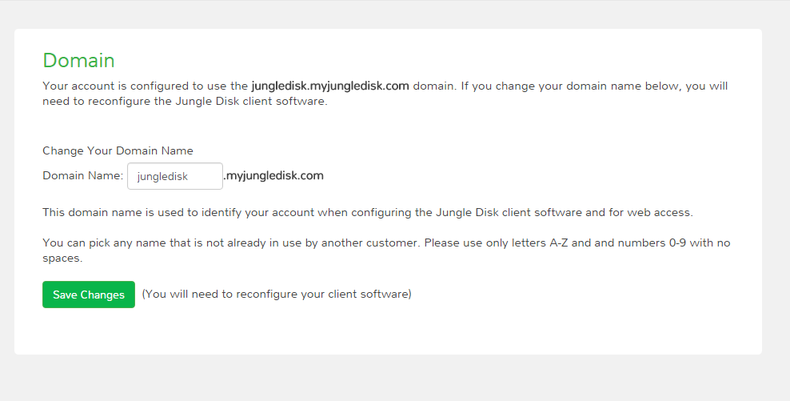
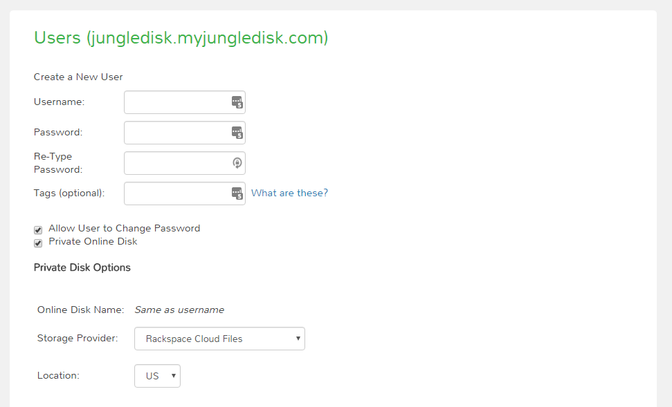
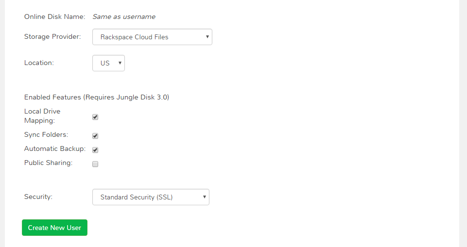

======================
Setting Up Jungle Disk
======================

System Requirements
===================
Version 3.21

**Windows** | Windows 7 or newer. 64 bit only.

**Mac** | 10.9 (Mavericks) or newer.

**Linux** | Ubuntu (recommended), Fedora, CentOS, RHEL.

Installation
======================

Windows
-------

#. Select the `Windows workgroup download <https://www.jungledisk.com/downloads/>`_.
#. Click "Save File" on the pop-up.
#. If the install package doesn't open on its own, check your browser's downloads area for the .msi file and open it.
#. A pop-up will appear. Click "Run".
#. The setup wizard will appear. Accept the End-User License Agreement, and select a drive to install the software on. We recommend using the K: drive letter or after in the alphabet to avoid conflict with external drives like USBs.
#. Once the software is installed, a prompt to restart will appear. You must restart to continue setting up the software.

Mac
---
.. youtube:: https://www.youtube.com/watch?v=AY_JpzEVPF0

#. Select the `macOS download <https://www.jungledisk.com/downloads/>`_.
#. Open the .dmg from the Downloads folder.
#. Drag the Jungle Disk icon into the Applications folder.
#. Open the Applications Folder, then Jungle Disk Workgroup. Your first set-up may take a few minutes.
#. If you are presented with a message that says the software will not open because it is from an unidentified developer, go to your Applications in finder, right-click the Jungle Disk app and select open.

.. Note:: If you have parental controls enabled on your Mac user account, you will need to add `https://s3.amazonaws.com` to the allowed sites list for your account or you may receive a "connection refused" error.

Linux
-----
`Select DEB, RPM, or TAR. <https://www.jungledisk.com/downloads/>`_
See `this article <https://support.jungledisk.com/hc/en-us/articles/200812234-Linux-System-Requirements/>`_
for more information on Linux setup.

.. Expand on Linux install directions (cannot find in support site)

Apple iOS
---------
Download from the `iTunes App Store <https://itunes.apple.com/us/app/jungle-disk/id359523081?mt=8>`_

Android
-------
Download from `the Google Play store <https://play.google.com/store/apps/details?id=com.rackspace.jungledisk>`_.

USB
---
Select the USB version `here <hhttps://www.jungledisk.com/downloads/>`_.

Administrator Setup
=======================
**This setup must be completed before users can login to the software.**

Administrators manage Users' access and general important information. Read on to learn how to do essential administrator tasks.

*Terms To Know:*
|br| *User:* A non-administrative user who will be using software to backup files and access files stored through Jungle Disk. The domain you set and their username/password will be what they use to verify their account with our software.
|br| *Online Disk:* Main storage point for Jungle Disk, this is where files and backups are stored. Accounts can have multiple Online Disks that can be accessed by one or many Users. Administrators can set "permissions" for users' access to disks.

**1. The Control Panel**
The Jungle Disk Control Panel is a secure site where you can perform administrator tasks. Think of it as the “bookkeeping” part of your Jungle Disk experience. We recommend bookmarking your Control Panel for easy access. Note your username and password and keep them a safe place.

'You can access the Control Panel here <https://secure.jungledisk.com/secure/account/>'_ Use the email address and password you used during the sign-up process.

This will be the page you will use whenever you need to:

* Check your Invoices
* Update your Billing Information
* Add or Remove Users
* Edit User Passwords/Permissions
* Add or Delete Online Disks
* Check Usage/Backup Reporting

**2. Domain Setup**
After logging into the Control Panel, click the admin drop down in the upper right corner. Select "Domain", then enter the name you'd like to use for your domain.

* The "domain" field will be used to log into Jungle Disk and into Web Access (Web Access is an Online tool used to view data you've uploaded to the Network Drive).

.. comment.... link within document to Web Access when section is complete & link relevant info

* For the domain name, you can use anything you wish as long as it is not already taken. We suggest using something easy to remember and representative of you, your team, or your company. Take note of this once you create it, as you will need this during the software configuration.

**3. User Setup**

.. Note:: Only Administrators can create User accounts.

Now that the domain is set, you need to create a User. If you'll be using Jungle Disk across a team, you may need to create several users.

From the main page, click "Manage Users & Permissions". Under the "Create a New User" heading, assign a username, password, and tags (optional, but may be helpful if you're setting up for a team). Tags are used if you want to sort your team members into separate reports; such as finance, marketing, etc. Users will not see their tag or know that their account is tagged.

.. Note:: Jungle Disk doesn't store Online Disk passwords, so we cannot recover them if they are forgotten. Keep a copy of your password in a secure place!

If the "Allow User to Change Password" box is checked, users will be allowed to change their passwords without an administrator.

If the "Private Online Disk" check-box is checked, this will create a new Online Disk with the same name as the username. The user will also be given Read/Write access to this Online Disk automatically. Step 4 of this guide will go over how to create Online Disks manually.

There are also other options, such as the storage provider, location, and additional security.

Click the "Create New User" button to complete this step. Within 5 minutes, you'll be able to log into our software and Web Access with this username. To quickly get to your Web Access site, on the top of the Control Panel, click on the Online Disk drop down, then Web Access.

**4. Online Disk Setup**
After you have set up your user(s), you may want to create additional online disks for you or your other users to access.

This is particularly useful in a team-based environment if you have two groups who need to access different sets of data. Your financial department may not need access to your developers' content, so you can set up a separate Online Disk for each group.

To create a new Online Disk, Click the "Online Disk" drop down on the top of the Control Panel. Next, select "Manage/Add Online Disks". You may want to use a name that represent the content of that disk; such as, "Finance" or "Documents." The name of a disk cannot be changed after it's created.

.. |br| raw:: html

    
