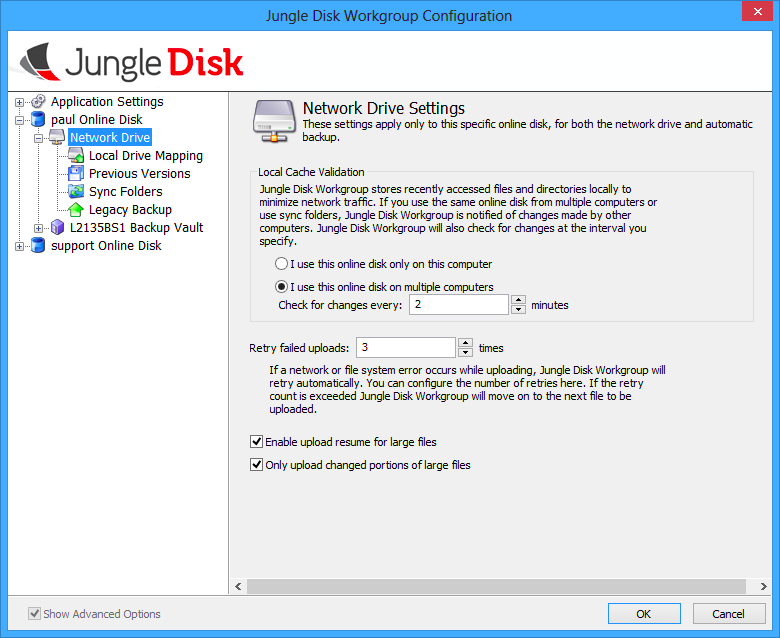
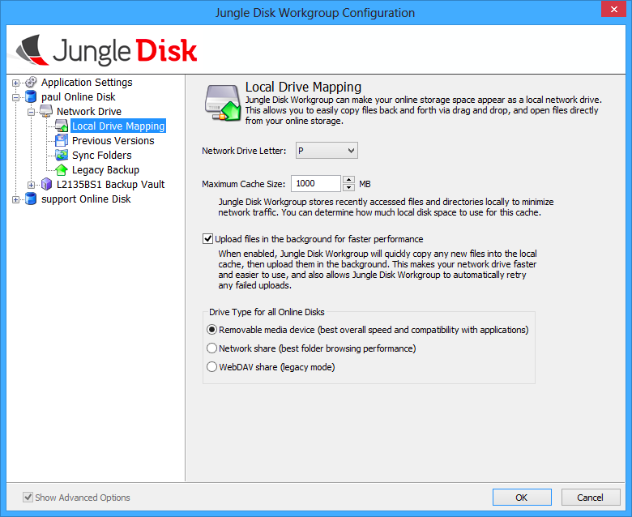
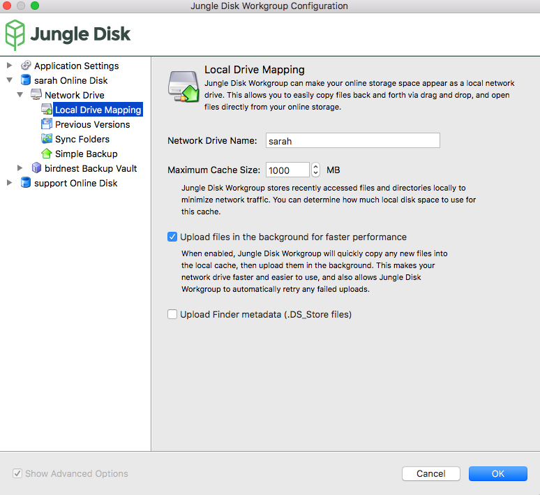
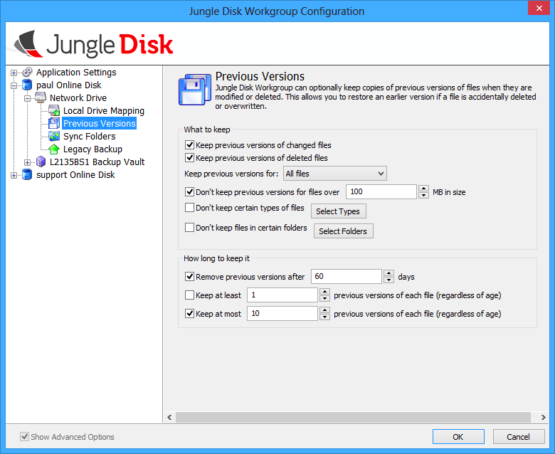
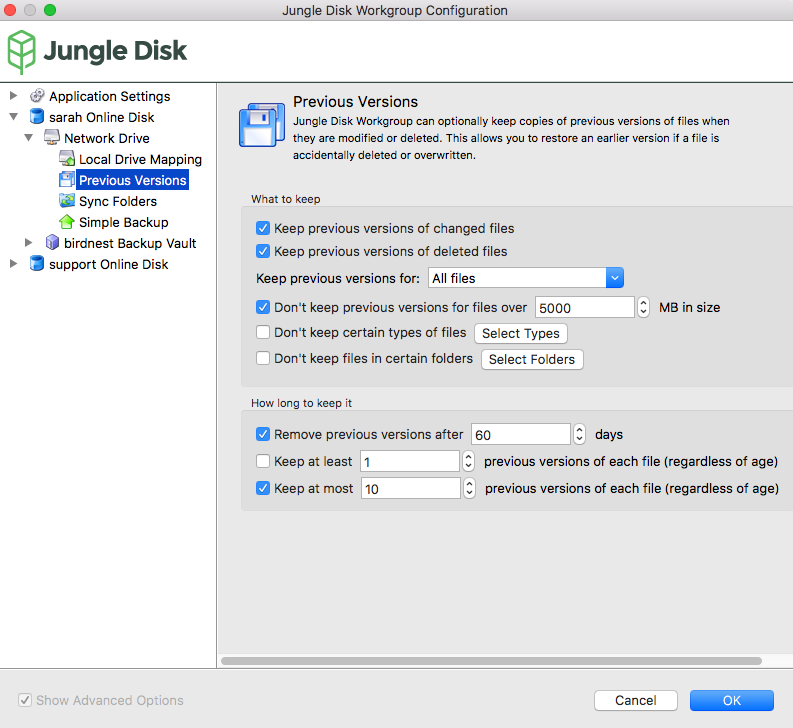

=================
The Network Drive
=================

The network drive offers a convenient way to store and access information. It can be used to temporarily store files, store files on a permanent basis, or share files with other users.

For convenience, it can also be mapped to one of your computer's drives, allowing for easy synchronization onto the web.

There are a few ways to upload data onto the network drive: via a Simple Backup, copying/pasting files from other folders into the network drive, and saving files directly to the network drive from the program creating them (for example, in Word, click Files > Save As > select the network drive as the save destination).

.. Note:: Do not use the Cut option with files on the network drive! If an error occurs while the file has been cut, you could lose the file. Instead, use Copy and Paste, then delete the files in the old location.

Network Drive
=============

Windows.

.. figure:: _static/004/nd2.png
Mac.

**Local Cache Validation:** Specifies if Jungle Disk will check the online disk for changes and how often.

**Retry failed uploads:** Sets the number of attempts Jungle Disk will retry a failed upload. If a file fails to  upload, it will be placed in a “Failed Uploads” folder until it is successfully uploaded in a subsequent attempt.

Local Drive Mapping
===================

Windows.

Mac.

**Network Drive Letter:** Assigns a drive letter to the network drive in Windows. Assigns a name on Mac, and a mount point on Linux.

**Maximum Cache Size:** Sets the cache size to the user’s preference. Set to 1000 MB by default.

**Upload files in the background for faster performance:** Check to allow uploads in the background.

**Drive Type for all Online Disks:** Allows the user to switch the drive type. Set to Removable media device by default.

.. _pv:

Previous Versions
=================

Windows.

Mac.

When you change the options below, they apply any time a file is uploaded or changed. So, you should run a Network Drive backup after making changes to ensure they are applied.

What to Keep
^^^^^^^^^^^^
**Keep previous versions of changed files:** This option enables retention of older versions of files once they are modified.

**Keep previous versions of deleted files:** This option enables deleted files to be kept on the online disk for the specified amount of time.

**Keep previous versions for:** Since [REF] Simple Backups are also stored on the network drive, you can specify if you would like these previous version settings applied to the entire network drive or just Simple Backups.

**Don’t keep previous versions for files over [XX] days:** Allows  the user to set a file size limitation for each previous version. Any file above the allotted amount (100  MB by default) will be purged immediately if it’s deleted. The previous version for any file will also be purged immediately if the file size is above this limit.

**Don’t keep certain types of files:** Allows the user to exclude certain files types from having previous versions created.

**Don’t keep files in certain folders:** Excludes any files held within a specified folder from having previous versions created.

How Long to Keep It
^^^^^^^^^^^^^^^^^^^
**Remove previous versions after [XX] days:** Sets the  amount of time each previous version or deleted file is held before being purged from the online disk.

**Keep at least [XX] previous versions of each file:** Allows the user to set the number of previous versions kept per file. If the user only wants to have a single previous versions and the current version of the file, they would set this option to 1.
Having this setting enabled will keep the specified amount of previous versions indefinitely for each file, so they will never be purged from the online disk. When enabled, this setting ignores the amount of time previous versions are retained by the “Remove previous versions after [XX] days” setting.

**Keep at most [XX] previous versions of each file:** Allows the user to limit the number of previous versions kept per file.

You can read about :ref:`Sync Folders <Sync Folders>` and :ref:`Simple Backups <Simple Backup>` in their respective sections.

Accessing Previous Versions
^^^^^^^^^^^^^^^^^^^^^^^^^^^
The recommended method to access a previous version is through Restore Files > Network Drive > select “A deleted file or previous version” or “Backup as of” in the Restore From section. Users can also access the  previous versions directly from the network drive by navigating to the “~VersionArchive” folder. This folder shows by  default within web access, however, you must manually enter this path when navigating to this folder from within  the file system.
