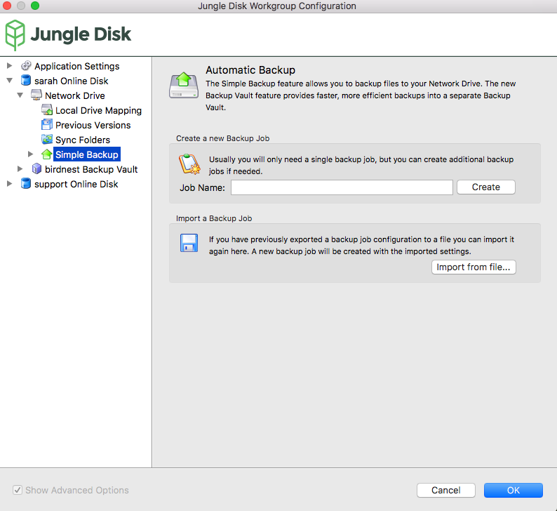
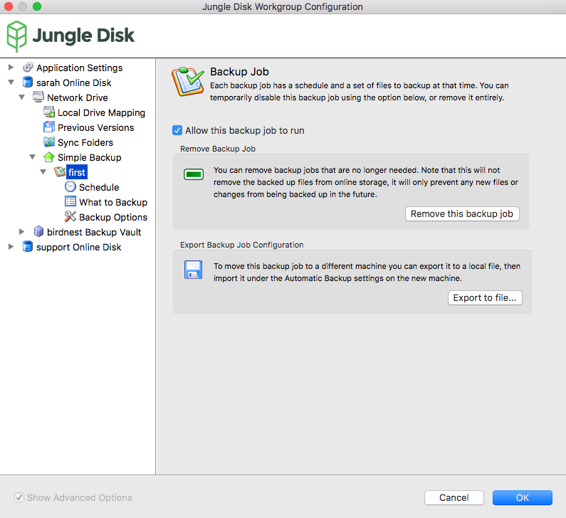
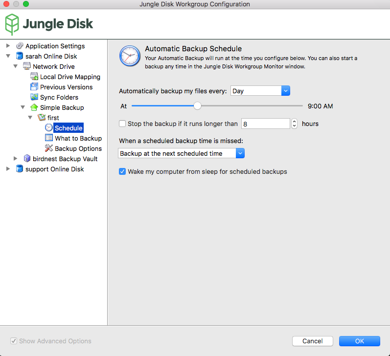
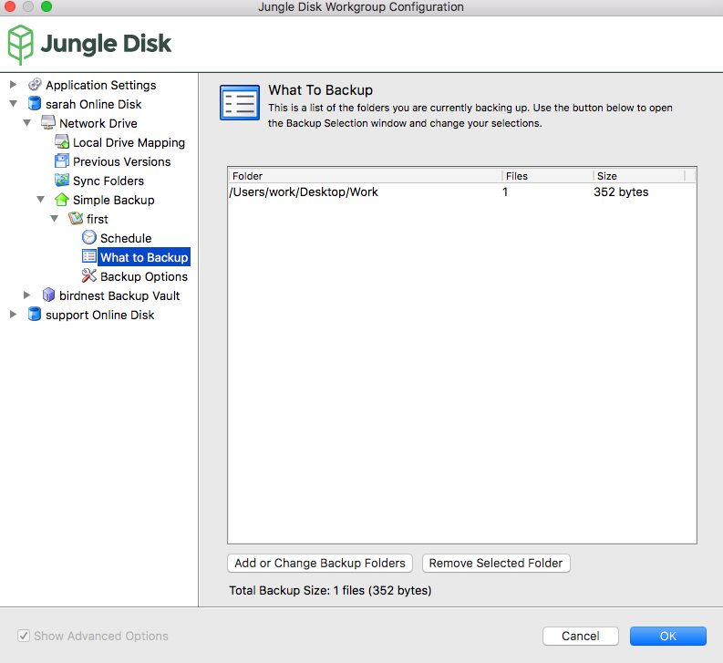
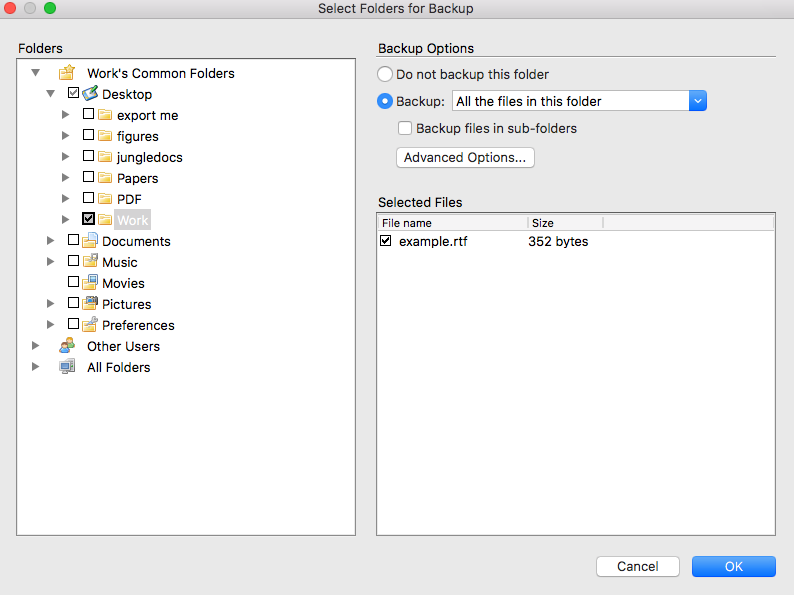
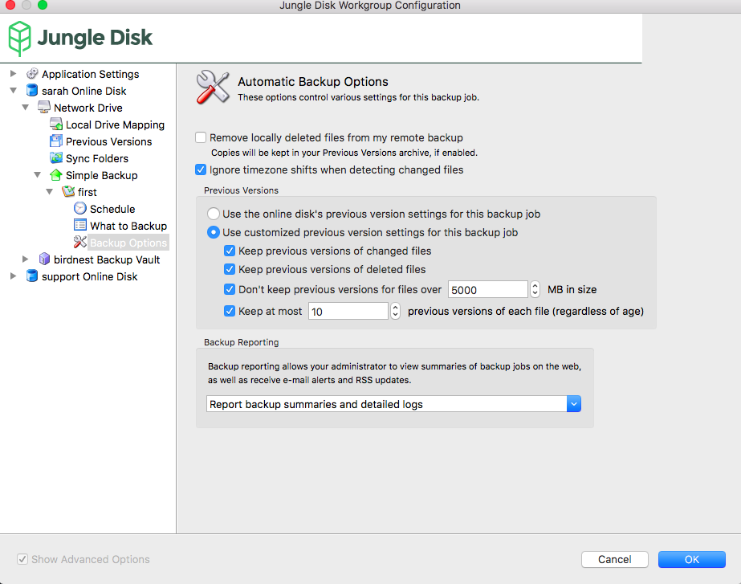

.. _Simple Backup:
=============
Simple Backup
=============

.. Note:: Simple Backup is formerly known as Legacy Backup.

Simple backup stores full files on the Network Drive and does not compress any data to save space. It can be accessed through the network drive or web access.

You can find simple backup data within a folder titled “backups” on the network drive. The Remote Backup Path option within the software will allow you to change how the data is stored within the network drive.

Advantages

* Easy, fast access
* Can download individual items without a full restore
* Can be viewed by multiple users
* Options to save or discard old versions of files
* Backups can be paused and resumed at any time

Limitations

* Meant for viewing only
* 5 GB file limit
* Cannot backup databases (SQL), Outlook, or system files
* Old versions of files are stored in full, so take up large amounts of space
* If moving to a new computer, you must change the file structure to match the old computer (within the “backups” folder on the network drive), or unnecessary re-uploading will occur

Simple Backup
=============

**Create a new Backup Job:** Name the backup job and click "Create". You can then click the drop-down arrow next to Simple Backup in the sidebar to configure options for your new backup job.

**Import a Backup Job:** Import existing backup job configurations here.

Backup Job
==========

**Allow this backup job to run:** Temporarily enable/disable a backup job.

**Remove Backup Job:** Remove a backup job. This will not delete the files in online storage, it will only stop updating changed or new files in the folder.

**Export Backup Job Configuration:** Exports Backup Job settings.

Schedule
--------

**Automatically backup my files every:** Choose how often and what time to run the backup.

**When the scheduled backup time is missed:** Choose from ASAP and At Next Scheduled Time.

What to Backup
--------------

**Add or Change Backup Folders:** Add or change backup folders or files.

**Remove Selected Folder** Removes folder selected above.

Folders
^^^^^^^
Select folders to back up. If you can't find the folder you're looking for, click "All Folders".

A black check mark indicates the folder is being backed up.

A grey check mark indicates a sub-folder in the folder is being backed up.

Backup Options
^^^^^^^^^^^^^^
**Do not backup this folder:** Disables backup for this folder.

**Backup:** Pick between: all the files in this folder (all files), only certain types of files (by file ending), all files except certain types, or only files I select in this folder.

Check "Backup files in sub-folders" to include the contents of folders include in the selected folders.

Select "Advanced Options" to include or exclude files based on wildcards. You can also change the path where Jungle Disk will save the directory's backups.

Selected Files
^^^^^^^^^^^^^^
Select or deselect files in the selected folder to backup.

Backup Options
--------------

**Remove locally deleted files from my remote backup**: If checked, the backup will delete files when you delete them on your computer.

**Ignore timezone shifts when detecting changed files:** If you have users located in another time zone, checking the option “Ignore timezone shifts when detecting changed files” will ensure that you are not creating and storing unnecessary previous versions.

Previous Versions
^^^^^^^^^^^^^^^^^
**Use the online disk's previous version settings:** By default, the retention for Simple Backups is inherited from the settings in place for the :ref:`network drive. <pv>` You can change this by selecting “Use customized previous version settings for this backup job".

**Keep previous versions of changed files:** This option enables retention of older versions of files once they are modified.

**Keep previous versions of deleted files:** This option enables deleted files to be kept on the online disk for the specified amount of time.

**Don't keep previous versions for files over [XX] MB in size:** Deletes previous versions for files over the size limit.

**Keep at most [XX] previous versions of each file (regardless of age):** Retains any amount of versions for each file.

Backup Reporting
^^^^^^^^^^^^^^^^
This feature allows your administrator to view summaries of backup jobs, and any errors that may occur during them, via email, RSS, or on the web. "Report backup summaries and detailed logs" is recommended, as it provides more information in case of a backup error.
