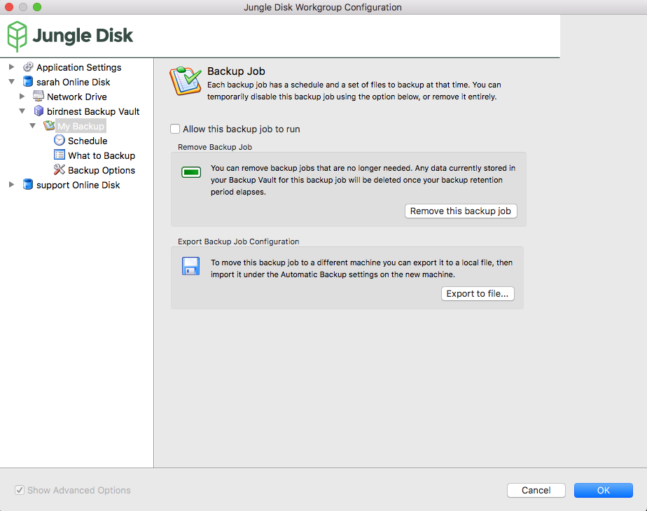

.. _vault:

================
The Backup Vault
================

The Backup Vault compresses and stores your files for recovery in the event of data loss. These files cannot be accessed in full on demand; only through the "Restore Files" section. Data compression allows large amounts of information to be stored for a low cost. For maximum efficiency, data that is easily replaced (such as applications) should be excluded.

The first backup that is run for the account is the only full backup done for the Backup Vault. Any subsequent backups will only upload changed portions of files or newly added files within the backup set.

To learn about the technical processes behind the Backup Vault works, see :ref:`How Does The Backup Process Work <how>`

Backup Vault
============

**Create a new Backup Job:** Name and create new backup jobs here. By default, a job titled "My Backup" will already exist.

**Import a Backup Job:** Import existing backup job configurations here.

**Delete Backup Vault:** Delete the backup vault and all the jobs within it.

Backup Job
==========
You can configure the settings for each Backup Job by clicking on its dropdown arrow.

Here, the example Backup Job is named "My Backup".

**Allow this backup job to run:** Temporarily enable/disable a backup job.

**Remove Backup Job:** Remove a backup job. This will not delete the files in online storage, it will only stop updating changed or new files in the folder.

**Export Backup Job Configuration:** Exports Backup Job settings.

Schedule
--------

**Automatically backup my files every:** Choose how often and what time to run the backup.

**When the scheduled backup time is missed:** Choose from ASAP and At Next Scheduled Time.

What to Backup
--------------
.. image:: _static/010/b4.png

**Add or Change Backup Folders:** Add or change backup folders or files.

**Remove Selected Folder** Removes folder selected above.

Folders
^^^^^^^
Select folders to back up. If you can't find the folder you're looking for, click "All Folders".

A black check mark indicates the folder is being backed up.

A grey check mark indicates a sub-folder in the folder is being backed up.

Backup Options
^^^^^^^^^^^^^^
**Do not backup this folder:** Disables backup for this folder.

**Backup:** Pick between: all the files in this folder (all files), only certain types of files (by file ending), all files except certain types, or only files I select in this folder.

Check "Backup files in sub-folders" to include the contents of folders include in the selected folders.

Select "Advanced Options" to include or exclude files based on wildcards. You can also change the path where Jungle Disk will save the directory's backups.

Selected Files
^^^^^^^^^^^^^^
Select or deselect files in the selected folder to backup.

Backup Options
--------------

**Ignore timezone shifts when detecting changed files:** If you have users located in another time zone, checking the option “Ignore timezone shifts when detecting changed files” will ensure that you are not creating and storing unnecessary previous versions.

Backup Retention
^^^^^^^^^^^^^^^^
Choose how often to clear out old data. This includes previous versions and deleted files. If unchecked, your old backups will be kept indefinitely. Keeping all backups may drastically increase charges.

.. Note:: You must adjust the retention period before uploading your files for the first time, or it will not apply. To change the retention period for existing files, copy the data from the backup vault to a secure location, then delete and make a new vault.

Backup Reporting
^^^^^^^^^^^^^^^^
This feature allows your administrator to view summaries of backup jobs, and any errors that may occur during them, via email, RSS, or on the web. "Report backup summaries and detailed logs" is recommended, as it provides more information in case of a backup error.

Previous Versions
=================
The backup vault stores previous versions for 60 days by default. You can change this, however, it must be done before the job is run for the first time. To edit the retention policy for a previously run job, the job must be deleted and re-uploaded.
