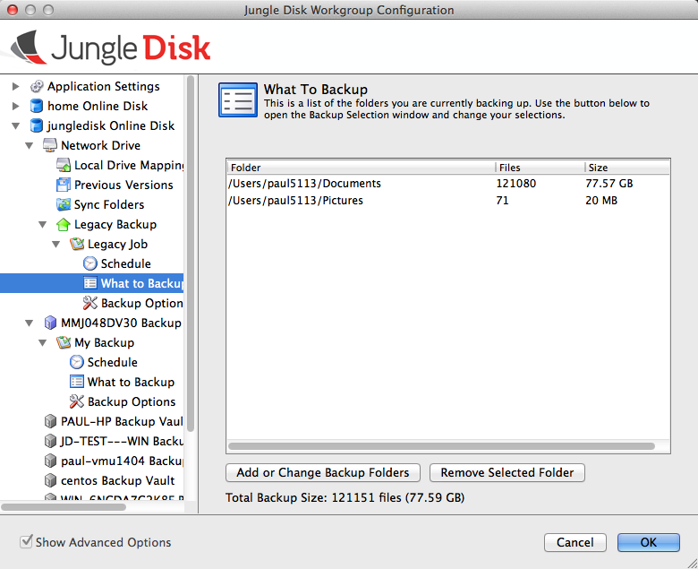

=======================
Configuring Backup Jobs
=======================
First, to create the backup job, select the Backup Vault or Legacy Backup from within the configuration window, and then create the backup job on the right.

3 basic options apply to Legacy Backups and Backup Vaults: Schedule, What to Backup, and Backup Options.

[insert screenshot and point out these 3 options]

Schedule
--------
The schedule can be set as frequently as every 5 and as little as once a week. The user will also have the option to set the backup to only run manually meaning they will need to manually run the backup through the software otherwise, no backups will occur. Backups cannot run while the computer is off or in a *hibernate state. The backup can run when the computer is in sleep mode; however, the “Wake my computer from sleep for scheduled backups” option must be selected in order to do so.

.. image:: _static/012/cc.png

What to Backup
--------------

Backup Reports
--------------

Include configuring backup reports
https://support.jungledisk.com/hc/en-us/articles/218746157-Configuring-Backup-Reporting-Notifications-Email-RSS-Feeds-
