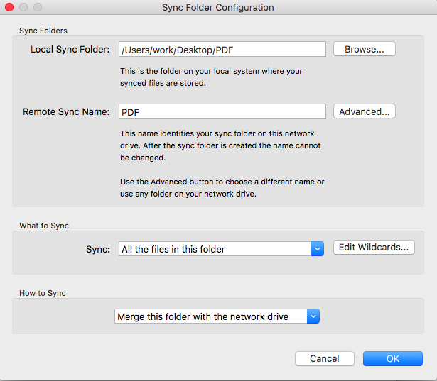

.. _Sync Folders:
============
Sync Folders
============
Sync folders are intended to be used by a single user and offer the ability to work with files when offline. This is  perfect for someone who travels frequently as they can access their files on the go and sync back up to the network drive when their Internet connection is re!established. They can also be used to keep different computers in different locations synced with changes being made (i.e. home/work computer). They work best when the data within the  sync folder is less than 10 GB or totals less then 100,000 files.
While you could set up a sync folder for use with multiple users, there is often more risk than is needed. There are more things that can go wrong with sync folders rather than the network drive. Here are a few things that happen when using sync folders in a multi-user environment:

* Creation of conflict files.
* Files/folders appear to be randomly deleted.
* Deleted files/folders reappear.

For these reasons, the Network Drive is recommended over Sync Folders for multi-user environments.

Sync Folder Creation
====================

Windows.

Windows.

.. figure:: _static/015/sf3.png
Mac.

Mac.

The local sync folder option will set the local folder from the computer that syncs with the network drive. You can either enter a path in manually, or use the Browse option to select the local folder.

The Advanced option will allow you to name the sync folder differently than how it may appear locally. You can also
select the folder to sync up with an existing folder on the network drive.

What to Sync
^^^^^^^^^^^^
Choose which files from the folder you want to sync. You may refine your selection with wildcards.

How to Sync
^^^^^^^^^^^
.. Note:: You must keep the same How to Sync options if you setup the sync folder in multiple locations. Otherwise, problems will occur.

**Merge this folder with the network drive:** This is the safest option if you're unsure of how you want your files to sync. This will ensure that the contents being saved in the local folder are synced with the network drive. It will also guarantee the reverse: that any files being stored within the sync folder on the network drive are being synced with the local folder. You will be able to view the sync folder within the folder titled “sync” on the network drive (unless its name was changed during configuration).

**Make the network drive match this folder:** This option makes the network drive to mirror the folder. Only use this if you only want to duplicate what's in your local folder. If you attempt to change a file from within the sync folder on the network drive, the changes will delete and mirror the version stored in the local folder. If the the local folder's contents are deleted, the  network drive will match the folder and also delete its contents from within the sync folder stored on it.
