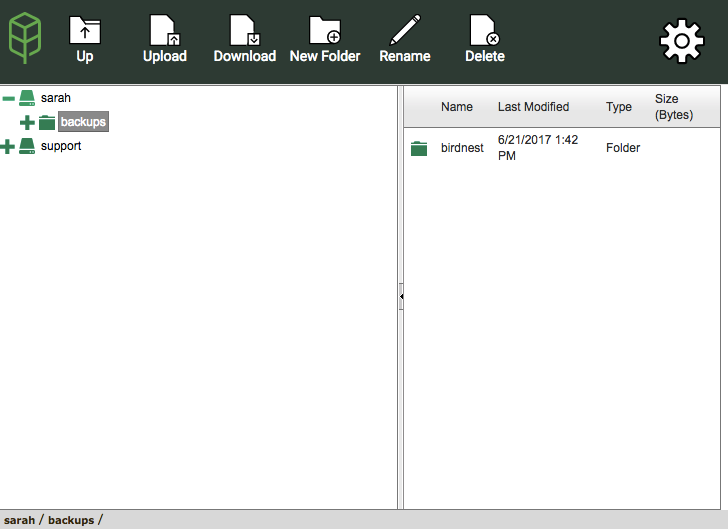

.. _web:

Web Access
==========
Web Access is a way to view files stored in the Network Drive.

Web Access is located at **https://[domain].myjungledisk.com.**
Insert the name of your domain in the URL. For example, a domain called mycompany would translate to *https://mycompany.myjungledisk.com.* You can find your domain under Application Settings > Account Settings on the software. 

The credentials to log into web-access are the same credentials you use to log into the software.

.. Note:: If you're a user, be aware that only your account administrator can use the Control Panel in Web Access.

You can upload and download files from within web access. However, there is a hard 1GB file limitation for any upload or download from web access. You can also only download single files - not folders or multiple items at once.
You will also have the option to create new folders, rename existing files/folders, or delete files/folders.

You are able to open items within the network drive to view or modify them. If you modify a file you opened in  web access, you will need to save the file locally and use the upload option to get the modified version stored on the network drive.

There will be a “~VersionArchive” folder inside Web Access. This folder stores previous versions. The settings for previous versions are configured with the :ref:`Network Drive. <pv>`
