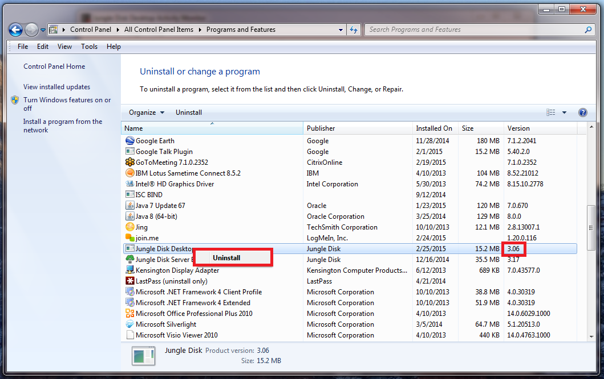

====================
Updating Jungle Disk
====================

Updating will not affect your current backup settings or your data.

mac/linux 3.20
https://support.jungledisk.com/hc/en-us/articles/115000012814-Updating-to-Jungle-Disk-3-20-for-Mac-and-Linux

3.16 windows and screenshots for windows/mac
https://support.jungledisk.com/hc/en-us/articles/204150844-Updating-Your-Jungle-Disk-Software-Version

Windows
=======
1. Click the Start Menu, then the Control Panel.

2. Click "Uninstall a Program" OR "Programs and Features".

**OR**

3. Find "Jungle Disk..." in the list of programs presented. Right-click the name of the program and click "uninstall."

4. The uninstallation will run, and you will be prompted to reboot the computer. **Do not reboot your computer, click "No."**

5. Download Windows Workgroup from the `downloads page. <https://www.jungledisk.com/downloads>`_

6. Navigate to the location where you saved the installer program. Open the installer program that was downloaded and click "Run."

7. Click "next," and complete the installation process. You will be promoted to reboot the computer, Click "no" to ignore the reboot request; this should not be necessary.

Open Jungle Disk. You can now resume using Jungle Disk normally.

Mac
===
1. Close the Jungle Disk program completely. You can force quit it by right clicking on the icon in the Dock then hitting the "option" button. The "Force Quit" option will then appear.
2. Select Mac Workgroup on the `downloads page. <https://www.jungledisk.com/downloads>`_
3. Open the .dmg file that you downloaded to launch the installer. A window will come up asking you to agree with the terms of the license. Click "Agree".
4. Another window will appear. Drag the Jungle Disk icon to the Applications folder. If you get a notification stating that Jungle Disk already exists, click "Replace" to replace the existing version of Jungle Disk.
5. After that, you can close that window and open the Jungle Disk program. Under the "Jungle Disk Workgroup" menu, click "About" to confirm that you are on the updated version. You may be prompted to enter your system password in order to update the "background programs" that the application uses. Please be sure to complete those prompts, otherwise the application may not be fully functional.

Linux
=====

RPM-Based Systems
-----------------

*The example RPM-based system used here is Fedora with the GNOME desktop environment.*

|br| **Via GUI**

1. Open the software management application, in Fedora, this is just called "Software"

2. Go to the "installed" tab and find Jungle Disk Workgroup.

3. Click "remove," approve the removal, and enter your system password (if needed).

4. Select the `Linux RPM Workgroup download. <https://www.jungledisk.com/downloads/>`_

5. Once the package has downloaded, open and install it. Follow the prompts on screen.

.. image:: _static/005/rpm.png
  :width: 700px

|br| **Via Terminal**

1. Check to see if Jungle Disk is already installed:
::

  dnf list | grep jungle

You may need to use yum or another package manager depending on your system configuration.

2. If there is an existing Jungle Disk installation, run a command to remove the package
::

  sudo dnf remove junglediskserver

Enter "Y" to approve the removal.

3. Next, be sure to stop the existing Jungle Disk process: the best way to do this is to first run
::

  ps aux | grep jungle

and get the PID for the existing process. Then you can run
::

  sudo kill [PID]

(be sure to replace [PID] with the actual PID on your machine)

4. Use wget to download the installer package. Check our `downloads page <https://www.jungledisk.com/downloads/>`_ for the most recent version, and copy the link address of that version.
::

  wget https://downloads.jungledisk.com/jungledisk/junglediskworkgroup-3211-0.x86_64.rpm

5. Once downloaded, run the installation command. You can also use your desktop GUI to start the apps (this may require you to log-out and log-in.)
::

  dnf install junglediskworkgroup

6. Enter "Y" to approve the install.

7. Since you had an existing install, there's no need to configure your settings file, so all you need to do is start the service.
::

 sudo /usr/local/bin/junglediskserver

DEB-Based Systems
-----------------
*The example DEB-based system used here is Ubuntu 16.04 with the Unity desktop environment.*

|br| **Via GUI**

1. Open the software management application, in Ubuntu, this is just called "Ubuntu Software"

2.Go to the "installed" tab and find Jungle Disk Workgroup.

3. Click "remove," approve the removal, and enter your system password (if needed).
If the existing application is not visible in Ubuntu Software, you will need to do this via Terminal.

  1. Open terminal (hit the command key and search for terminal)
  2. Run
::

  sudo dpkg -r junglediskworkgroup

3. Enter your system password and press enter. You can now close terminal and continue the steps below

4. Download DEB Linux Workgroup from our `downloads page. <https://www.jungledisk.com/downloads/>`_

5. Once the package has downloaded (likely to your downloads folder), open it up and you will be given the option to install. Click the install button and follow the prompts on screen

6. At this point, you should be all set! We recommend logging out of your desktop and logging back in before using the new version.

|br| **Via Terminal**

1. Check to see if Jungle Disk is already installed:

::

  dpkg -l | grep jungle

You may need to use yum or another package manager depending on your system configuration.

2. If there is an existing Jungle Disk installation, run a command to remove the package:

::

  sudo dpkg -r junglediskworkgroup

3. Next, be sure to stop the existing Jungle Disk process: the best way to do this is to first run

::

  ps aux | grep jungle

and get the PID for the existing process. Then you can run:

::

  sudo kill [PID]

Be sure to replace [PID] with the actual PID on your machine.

4. Use wget or something similar to download the new installer package:

::

  wget https://downloads.jungledisk.com/jungledisk/junglediskserver_3200-0_amd64.deb

Once downloaded, run the installation command: sudo dpkg -i junglediskserver_3200-0_amd64.deb
Since you had an existing install, there's no need to configure your settings file, so all you need to do is start the service!

::

  sudo /usr/local/bin/junglediskserver

.. |br| raw:: html

    
