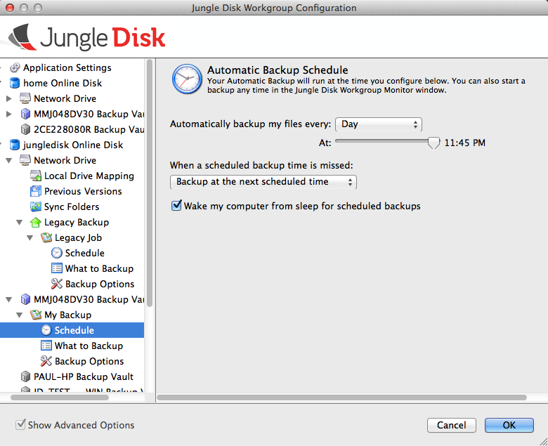
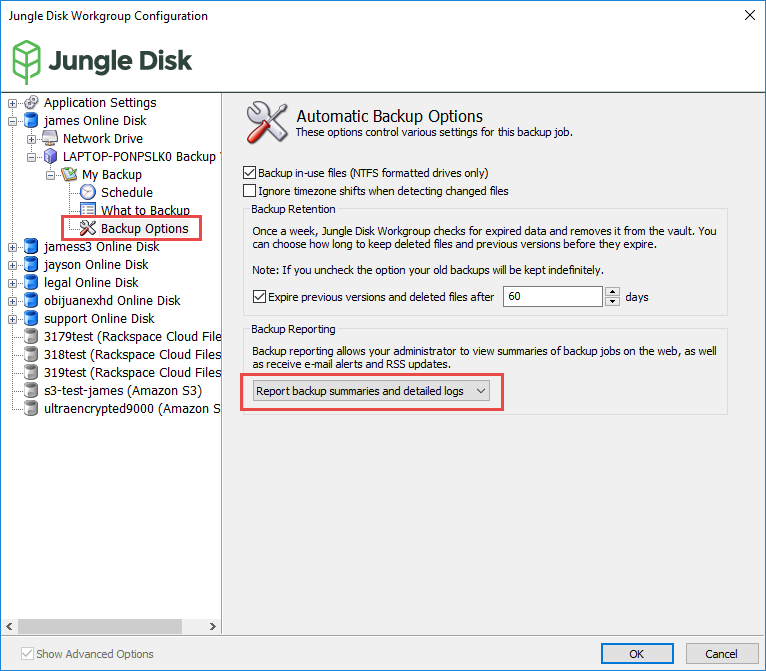

=======================
Configuring Backup Jobs
=======================
First, to create the backup job, select the Backup Vault or Legacy Backup from within the configuration window, and then create the backup job on the right.

3 basic options apply to Legacy Backups and Backup Vaults: Schedule, What to Backup, and Backup Options.

Schedule
--------
The schedule can be set as frequently as every 5 times per week and as little as once per week. You will also have the option to set the backup to only run manually, meaning you will need to manually run the backup through the software or no backups will occur. Backups cannot run while the computer is off or in a hibernation state. The backup can run when the computer is in sleep mode; however, the “Wake my computer from sleep for scheduled backups” option must be selected in order to run.

What to Backup
--------------
.. image:: _static/012/cc2.png
  :width: 700px

This tab provides a summary of the number of files being backed up, as well as the total amount of data included in the backup. You can change what folders to backup by clicking "Add or Change Backup Folders".

You can exclude a file in a folder by unchecking the box next to it. You also have the option to exclude files by file type - this can be done by clicking the drop down menu next to "Backup:".

Click the Advanced Options button to modify the directory that files upload with Legacy Backup.

..Note:: Legacy backup relies on the directory to know which files have been uploaded. If you move to a new computer, you should make the new directory mirror the original, or duplicate copies will be uploaded.

Add wildcards to exclude subfolders or files from a legacy or backup vault backup.

The most commonly used wildcard is the asterisk, which represents 0 or more characters following the original letters. For example, sand* would refer to any folder titled "sand" and any folder titled "sand" with letters after, like "sandy" or "sandwich".

Options
-------

Backup Reports
==============

Backup Reporting is a way to keep track of your backup jobs by receiving an email or RSS Feed Update.

Basic backup reporting is enabled by default, and will let you know if it completed successfully, failed, or completed with errors. You can also turn on detailed logs, which tell you more about errors, if they occur, through the control panel in Web Access.

You can set your preferred Frequency for email delivery:

* Immediately - send me an email as soon as any backup completes
* Daily - send me a digest covering all backups that were performed each day
* Weekly - send me a weekly digest
* Never - don't send me any emails

You also have a set of options that allow you to limit the Scope of your RSS Feed updates:

* All Computers
* One Computer
* One Sub-Account
* One Tag

Configuring Backup Reports
--------------------------

1. Open the Jungle Disk software. Select "Report backup summaries and detailed logs".

2. Go to the `control panel. <http://secure.jungledisk.com/login.aspx>`_  Click Reports, then Backup Report Preferences.

3. Choose the frequency of email reports.

4. (Optional) Set up an RSS feed. Choose which sub-account you want to report on, then click Create New Feed.

 .. image:: _static/012/d8.png
   :width: 700px

 After clicking on "Create Feed" you will see the feed listing that was created for you. You can right-click the RSS link or Atom link to copy the URL for either of these feed types and use them in your feed aggregator.

 .. image:: _static/012/d9.png
    :width: 700px
